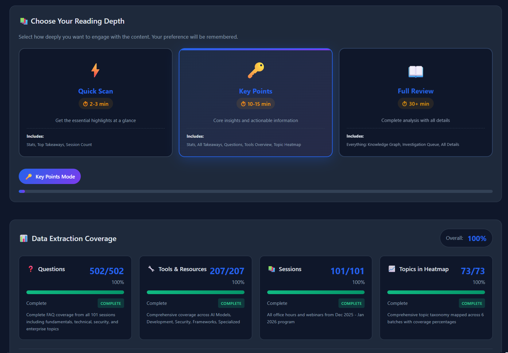

# Distill

**LLM-powered intelligence extraction pipeline for transcripts.**

Transform meetings, lectures, and calls into interactive executive dashboards. Multi-source, quality-reviewed, multi-destination.

*Prompts are the product; runners are swappable.*



*Example dashboard generated from 100+ lecture transcripts*

---

## What Distill Does

1. **Pulls transcripts** from Zoom, Google Drive, Otter.ai, S3, or local files
2. **Extracts intelligence** — questions, decisions, action items, insights, and custom patterns
3. **Synthesizes across sessions** to find patterns, gaps, and trends
4. **Quality reviews** via 3-pass automated checking with auto-fix
5. **Generates executive dashboards** with interactive visualizations
6. **Exports anywhere** — Google Drive, Notion, Airtable, email, S3, JSON

---

## Architecture

Distill is a **prompt library** with multiple runners. The prompts encode the methodology; the runners are just execution environments.

```
core/prompts/          ← The methodology (this is the product)
├── analyze-file.md
├── synthesize.md
├── generate-dashboard.md
├── generate-json.md
└── quality-review/
    ├── content-accuracy.md
    ├── visual-design.md
    ├── technical-quality.md
    └── improve.md

runners/               ← Execution options (pick your platform)
├── python/            ~300 line CLI, anthropic SDK
└── n8n/               Visual workflow, no-code
```

Use the prompts with **any** LLM orchestration: Python CLI, n8n, LangChain, OpenAI Agents, CrewAI, or direct API calls.

---

## Quick Start

### Option A: Python CLI

```bash
cd runners/python
pip install -r requirements.txt
export ANTHROPIC_API_KEY=your-key

# Basic usage
python distill.py /path/to/transcripts

# With custom extractors
python distill.py ./transcripts --extractors '[{"name": "Action Items", "pattern": "todo|action"}]'

# Full options
python distill.py ./transcripts \
  --output ./results \
  --format both \
  --project-name "Q1 Meetings" \
  --parallel 3
```

### Option B: n8n Workflow

1. Import `runners/n8n/distill-main.json` and `distill-analyzer.json`
2. Configure Claude Bridge ([setup guide](docs/claude-bridge-setup.md))
3. Trigger via form or webhook

```bash
curl -X POST https://your-n8n/webhook/distill \
  -H "Content-Type: application/json" \
  -d '{"projectName": "Q1 Sales Calls"}'
```

### Option C: Use Prompts Directly

The prompts in `core/prompts/` work with any LLM. Variables use `{{placeholder}}` syntax. Plug them into:
- LangChain / LangGraph
- OpenAI Agents SDK
- CrewAI / AutoGen
- Any Claude/GPT API wrapper

See `core/schemas/config.schema.json` for configuration options.

---

## Use Cases

### 🏢 Meeting Intelligence
Surface recurring blockers, track decisions, catch dropped action items across weeks of standups.

### 📞 Sales Call Analysis
Extract objections, competitor mentions, pricing discussions, commitment language.

### 🎯 Customer Research
Synthesize pain points, feature requests, and sentiment from user interviews.

### 🎓 Educational Content
Generate study guides, Q&A indexes, and topic coverage heatmaps from lectures.

### 🎙️ Podcast Management
Build searchable archives with guest insights, quotes, and topic indexes.

### 📊 Executive Briefings
Auto-generate weekly digests from department meetings with decisions and risks.

---

## Pipeline

```
┌─────────────────────────────────────────────────────────────────┐
│                     SOURCE INTEGRATIONS                          │
│   📹 Zoom    📁 Google Drive    🎙️ Otter.ai    ☁️ S3    📄 Local │
└────────────────────────────┬────────────────────────────────────┘
                             ▼
┌─────────────────────────────────────────────────────────────────┐
│                    INTELLIGENT EXTRACTION                        │
│   Standard: Questions, Topics, Tools, Participants, Insights    │
│   Custom: Your patterns (Action Items, Decisions, Risk Flags)   │
└────────────────────────────┬────────────────────────────────────┘
                             ▼
┌─────────────────────────────────────────────────────────────────┐
│                   CROSS-SESSION SYNTHESIS                        │
│   Pattern detection • Topic frequency • Gap analysis • Trends   │
└────────────────────────────┬────────────────────────────────────┘
                             ▼
┌─────────────────────────────────────────────────────────────────┐
│                      QUALITY ASSURANCE                           │
│   3-pass review: Content accuracy → Visual design → Technical   │
│   Auto-fix issues • Loop until quality passes                   │
└────────────────────────────┬────────────────────────────────────┘
                             ▼
┌─────────────────────────────────────────────────────────────────┐
│                         OUTPUT                                   │
│   📊 Interactive Dashboard    📋 Structured JSON                 │
│   Knowledge graph, heatmaps   API-ready, import anywhere        │
└────────────────────────────┬────────────────────────────────────┘
                             ▼
┌─────────────────────────────────────────────────────────────────┐
│                    EXPORT DESTINATIONS                           │
│   📁 Google Drive   📝 Notion   📊 Airtable   ☁️ S3   📧 Email   │
└─────────────────────────────────────────────────────────────────┘
```

---

## Custom Extractors

Define patterns that matter to YOUR use case:

```json
[
  {
    "name": "Customer Pain Points",
    "pattern": "frustrated|annoying|difficult|hate|problem",
    "instructions": "Extract complaints with context and severity"
  },
  {
    "name": "Competitor Mentions",
    "pattern": "Salesforce|HubSpot|competitor|switching",
    "instructions": "Note what was said and sentiment"
  }
]
```

Custom extractors run **in addition to** standard extraction and get dedicated dashboard sections.

---

## Supported Formats

| Format | Extension | Use Case |
|--------|-----------|----------|
| WebVTT | .vtt | Zoom, web players |
| SubRip | .srt | Video editing, YouTube |
| Plain Text | .txt | Otter.ai, manual transcripts |
| JSON | .json | Whisper, AWS Transcribe |

---

## Output

### Interactive Dashboard
Self-contained HTML with:
- D3.js knowledge graph
- Topic heatmap
- Searchable Q&A explorer
- Session navigator
- Custom extractor views
- Dark/light mode
- Mobile responsive

### Structured JSON
```json
{
  "metadata": { "projectName": "...", "runId": "..." },
  "summary": { "totalSessions": 47, "keyTakeaways": [...] },
  "sessions": [...],
  "questions": [...],
  "customExtractors": { "action_items": [...], "decisions": [...] }
}
```

---

## Configuration

| Category | Options |
|----------|---------|
| **Metadata** | Project name, title, participants, tags, date range |
| **Styling** | Colors, logo URL, custom CSS |
| **Processing** | Output format, incremental mode, sections to include |
| **Quality** | Enable/disable review loop, max iterations |
| **Source** | Integration type and credentials |
| **Export** | Destinations (gdrive, notion, s3, email, airtable) |
| **Extractors** | Custom patterns and instructions |

Full schema: `core/schemas/config.schema.json`

---

## Requirements

**Python CLI:**
- Python 3.10+
- `anthropic` package
- `ANTHROPIC_API_KEY` environment variable

**n8n Workflow:**
- n8n v1.0+
- Claude Bridge service ([setup guide](docs/claude-bridge-setup.md))

---

## License

MIT License — See [LICENSE](LICENSE)

---

**Transform recordings into intelligence.**

*Created by Joshua Burdick — [GitHub](https://github.com/GixGosu) | [Cyberarctica](https://cyberarctica.com)*
